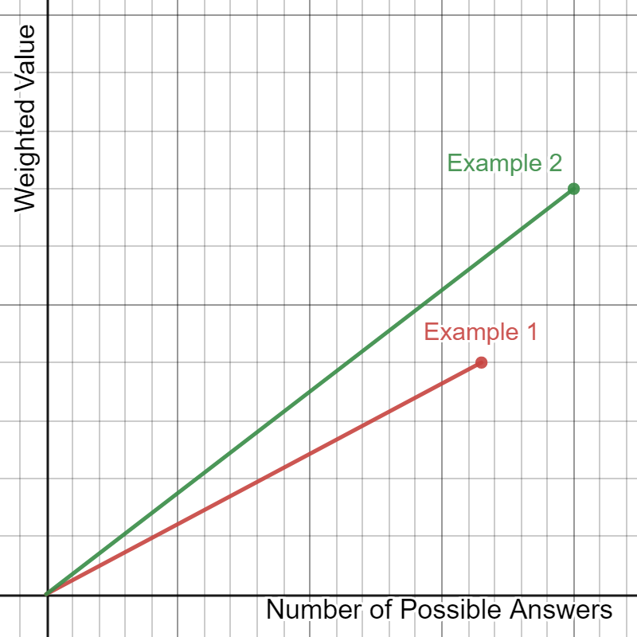

  <h2 align="center">
    Hi there, let me introduce you to <strong>WordleSolver</strong>. 
  </h2>
    
  <h4 align="center" style="margin-top: -10px">
    WordleSolver is an advanced algorithm that calculates the best possible guess in popular game Wordle.
  </h4>
    
  

    
    
    
    
    
    
  

    
  

  

    <strong>DISCLAIMER:</strong> I have no intentions of "ruining the fun" in Wordle for some people. This game has brought together so many people in such a wonderful way, please don't use my creation as a threat towards that. People have had a very positive experience with this game and its unique possibilities; this is my way of expressing my passion towards problem-solving and Wordle's unique structure. I hope you have the chance to see the good in this project and what I have created, thank you.
  

    
  <h3 align="center">
    Source Code
  </h3>
    
  

    The original code for this project is written in Python and can be found in <a href="https://github.com/StarbuckBarista/WordleSolver/tree/master/src/python">src/python/</a>. I have plans to create a web interface based around JavaScript that will be implemented soon.
      
    Inside the source code, you will find five configurable values that help this algorithm to find the best answer:
  

    
  <h4 align="center">
    Incorrect Words
  </h4>
    
  

    Incorrect words are all the words that we can be certain are not the answer. The only way to obtain these words are through guesses that are fully incorrect.
      
    If you were to guess <code>WORDLE</code> as your first guess and the answer is not correct, you would set the value to <code>["wordle"]</code>.
  

    
  <h4 align="center">
    Known Minimums
  </h4>
    
  

    Known minimums are all the letters that we can be certain have some representation in the answer. The only way to obtain these letters are through incorrect and correct placements.
      
    If you were to guess <code>WORDLE</code> as your first guess and the letters O and E are in the incorrect placement, you would set the value to <code>{"o": 1, "e": 1}</code>.
  

    
  <h4 align="center">
    Known Maximums
  </h4>
    
  

    Known maximum are all the letters that we can be certain have limited representation in the answer. The only way to obtain these letters are through incorrect letters.
      
    If you were to guess <code>WORDLE</code> as your first guess and the letters W, R, D, and L are incorrect, you would set the value to <code>{"w": 0, "r": 0, "d": 0, "l": 0}</code>.
  

    
  <h4 align="center">
    Incorrect Placements
  </h4>
    
  

    Incorrect placements are all the letters that we can be certain are not in a specific location. The only way to obtain these letters are through incorrect letters and incorrect placements.
      
    If you were to guess <code>WORDLE</code> as your first guess and the letters O and E are incorrect letters and the letter L is an incorrect placement, you would set the value to <code>{1: ["o"], 3: ["l"], 4: ["e"]}</code>.
  

    
  <h4 align="center">
    Correct Placements
  </h4>
    
  

    Correct placements are all the letters that we can be certain are in the answer, and in a specific location. The only way to obtain these letters are through correct placements.
      
    If you were to guess <code>WORDLE</code> as your first guess and the letters O and E are in the correct placement, you would set the value to <code>{1: "o", 4: "e"}</code>.
  

    
  

    
  <h3 align="center">
    Guessing Strategies
  </h3>
    
  

    This algorithm utilizes two similar methods of guessing depending on how far the game has progressed:
  

    
  <h4 align="center">
    First Guesses
  </h4>
    
  

    The first guessing strategy is called when the number of possible solutions is above 500. This is because the algorithm is able to precisely find the solution when the number of possible answers is below 500.
      
    This method matches every single possible guess with every single possible answer and calculates the number of possible answers that will be remaining if those two values are together. The possible answer list is then weighted using a method which will be defined below for further clarity. For each possible guess, the average of every one of those weighted values is taken and compared against the current best. 
  

    
  <h4 align="center">
    Last Guesses
  </h4>
    
  

    The last guessing strategy is called when the number of possible solutions is above 500. This is because the algorithm is able to precisely find the solution when the number of possible answers is below 500.
      
    This method matches every single possible guess with every single possible answer and calculates the number of possible answers that will be remaining if those two values are together. The possible answer list is then weighted using a method which will be defined below for further clarity. For each possible guess, the average of every one of those weighted values is taken and compared against the current best. 
  

    
  <h4 align="center">
    Weighting the Possible Answers
  </h4>
    
  

    To give a score to a list of possible answers, both similarity between the answers and number of possible answers are considered. Similarity is important here, because we are able to narrow down more precisely when our possible answers are more similar to one another.
      
    In order to consider both of these values, a coordinate plane is drawn in which the y-axis represents the similarity on a scale from 0-1, and the x-axis represents the inverted number of possible answers. Then, the distance from origin (0, 0) is calculated and set as the weighted value.
      
    
  

